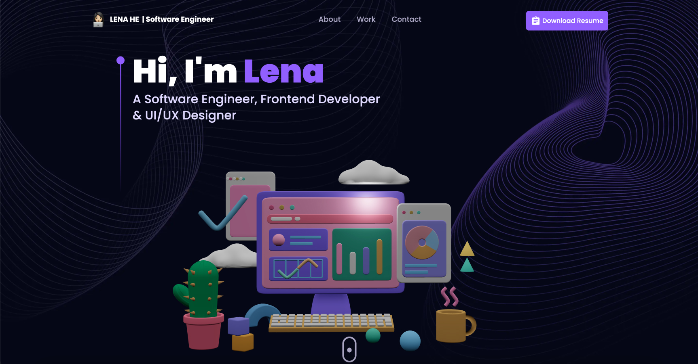

# Project 3D - Portfolio

<p align="center">
  
</p>

This is my first portfolio project using Next.js and Three.js. Originally from [Om's 3D Portfolio](https://github.com/omunite215/Project_3DPortfolio), initially made using tutorial of [JavaScipt Mastery](https://youtu.be/0fYi8SGA20k?feature=shared).

Work done on it other than the tutorial:-
- Removed unused CSS.
- Removed Extra Animations.
- Made UI Faster.
- Added a Resume Button.
- Enhanced Visibility and solved Responsive UI Problems.
- Fixed react vertical timeline animation with Next.js

This Project is hosted on Vercel : [3D Portfolio](https://lenahe-dev-portfolio.vercel.app)

## 🏠 Built With:

[](https://skillicons.dev)


## 🚀 About Me
Specializations:
- Frontend Development.
- Full Stack Web Development.
- UI/UX Design.

## 🛠 Skills

[](https://skillicons.dev)


# Getting Started

These instructions will get you a copy of the project up and running on your local machine for development and testing purposes.

Prerequisites
Before you start, make sure you have the following software installed on your computer:

[](https://skillicons.dev) Node v18.17.0


## ℹ️ How to use this Repository?

1. Clone the repository to your local machine

```bash
  git clone https://github.com/leneehe/project_3D_dev_portfolio.git

```
2. Navigate to the project directory

```bash
  cd Project_3DPortfolio
```
3. Install the necessary dependencies
```bash
  npm install
```

4. Start the development server
```bash
  npm run dev
```

The website should now be up and running on http://localhost:3000.


## 🗒️ Authors
- Lena He

<p align="left">
  <a href="https://skillicons.dev">
    <a href="https://github.com/leneehe">
      
    </a>
  </a>
</p>

## 🙋🏻‍♀️ Connect With Me

[](https://github.com/leneehe)&nbsp;
[](https://www.linkedin.com/in/lenahe/)&nbsp;
[](https://github.com/leneehe)
<br>
<br>
<p align="center">
  
</p>
